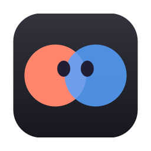

<p align="center">
  
</p>

<h1 align="center">Mimo</h1>

<p align="center">
  Real-time German → English subtitles for <b>anything your Mac plays</b> —
  Microsoft Teams, Zoom, YouTube, TV streams.<br>
  100% local · no API keys · no audio ever leaves your Mac.
</p>

---

Mimo is a small native macOS app that floats a subtitle panel above
every window (including full-screen meetings). It taps the system audio
output, runs OpenAI's Whisper model on the GPU via
[whisper.cpp](https://github.com/ggml-org/whisper.cpp), and shows English
text a few seconds after someone speaks German.

The mascot is two overlapping orbs, coral for German and blue for English,
sharing one pair of eyes: two languages, one understanding.

## Features

- **Works with any app** — captures system audio, so there's nothing to
  configure per app.
- **Fully offline** — Whisper runs on-device with Metal acceleration.
- **EN / DE toggle** — live English translation, or the raw German transcript.
- **Always-on-top overlay** — frosted-glass panel that doesn't steal focus
  from your meeting; drag, resize, adjust opacity and text size.
- **Menu-bar control** — show/hide subtitles and start/pause listening from
  the menu bar; closing the panel hides it instead of quitting.
- **Smart model choice** — picks the best downloaded model per mode
  automatically.

## How it works

```
Any app's audio ──▶ ScreenCaptureKit (system-audio tap, 16 kHz mono)
                        │
                        ▼
              whisper.cpp (Metal GPU), German speech
                 ├─ EN mode: translate → English
                 └─ DE mode: transcribe → German
                        │
                        ▼
              Floating always-on-top overlay panel
```

Audio is buffered and re-transcribed every ~1.2 s, shown as a dim "live"
line. When the speaker pauses (or after ~9 s), the line is committed to the
transcript and the buffer is cleared.

## Requirements

- macOS 14 (Sonoma) or newer, Apple Silicon recommended
- Xcode Command Line Tools — `xcode-select --install`
- CMake — `brew install cmake`
- ~1.1 GB of disk space for the models

## Getting started

```bash
git clone --recursive https://github.com/hussain-abbas-06228/Mimo.git
cd Mimo

scripts/download-model.sh   # downloads the two default models (~1.1 GB)
./build.sh                  # builds whisper.cpp (first time only) + the app
./run.sh                    # launches build/Mimo.app
```

On first launch macOS asks for **Screen & System Audio Recording**
permission — this is how the app hears your Mac's audio (video frames are
discarded). Enable **Mimo** under *System Settings → Privacy &
Security → Screen & System Audio Recording*, then relaunch.

To check everything works, run `./test.sh` while the app is open: your Mac
speaks a few German sentences and their English translation should appear
in the overlay.

## Usage

| Control | What it does |
|---|---|
| ▶ / ⏸ | Start / pause listening |
| EN / DE | English translation / German transcript |
| ◐ slider | Background opacity |
| A− / A+ | Text size |
| 🗑 | Clear transcript |
| ⌄ or red close button | Hide the panel (app keeps running) |
| Menu-bar 💬 icon | Show/hide subtitles, start/pause, quit |

Expect a delay of about 2–4 seconds — normal for speech translation.

## Models

Models live in `models/` and are chosen per mode:

| Mode | Preferred model | Why |
|---|---|---|
| EN (translate) | `ggml-medium-q5_0.bin` | Most accurate German → English. Turbo models can't translate, so they're never used here. |
| DE (transcribe) | `ggml-large-v3-turbo-q5_0.bin` | Most accurate *and* fastest German transcription. |

If a preferred model is missing, the app falls back to whatever else is in
`models/` (e.g. `scripts/download-model.sh small` for a lighter setup). You
can also force one model for both modes with the `WHISPER_MODEL` environment
variable.

Measured on an M1 Pro with a 24 s German sample: small 1.5 s, medium-q5_0
2.7 s, large-v3-turbo-q5_0 2.0 s.

## Project layout

| Path | What it is |
|---|---|
| `src/main.swift` | App delegate, menu bar item, model selection |
| `src/AudioCapture.swift` | System-audio capture via ScreenCaptureKit |
| `src/TranscriptionController.swift` | Buffering, silence detection, streaming loop |
| `src/WhisperEngine.swift` | Thin wrapper around the whisper.cpp C API |
| `src/ContentView.swift`, `src/OverlayPanel.swift` | SwiftUI overlay UI and floating panel |
| `scripts/` | Model download and icon generation |
| `vendor/whisper.cpp/` | whisper.cpp (git submodule) |

The app is built with plain `swiftc` — no Xcode project needed.

## Troubleshooting

- **Permission error in the panel** → enable Mimo under *System
  Settings → Privacy & Security → Screen & System Audio Recording*, then
  relaunch.
- **Permission is on but it still fails** → the grant belongs to an older
  build (each rebuild changes the ad-hoc signature). `./build.sh` resets it
  automatically; otherwise run
  `tccutil reset ScreenCapture io.github.hussain-abbas-06228.mimo` and relaunch.
- **No text appears** → make sure the audio is playing on *this* Mac.
- **"Whisper model not found"** → run `scripts/download-model.sh`.

## License

[MIT](LICENSE). whisper.cpp is MIT-licensed by its authors; Whisper models
are released by OpenAI under the MIT license.
